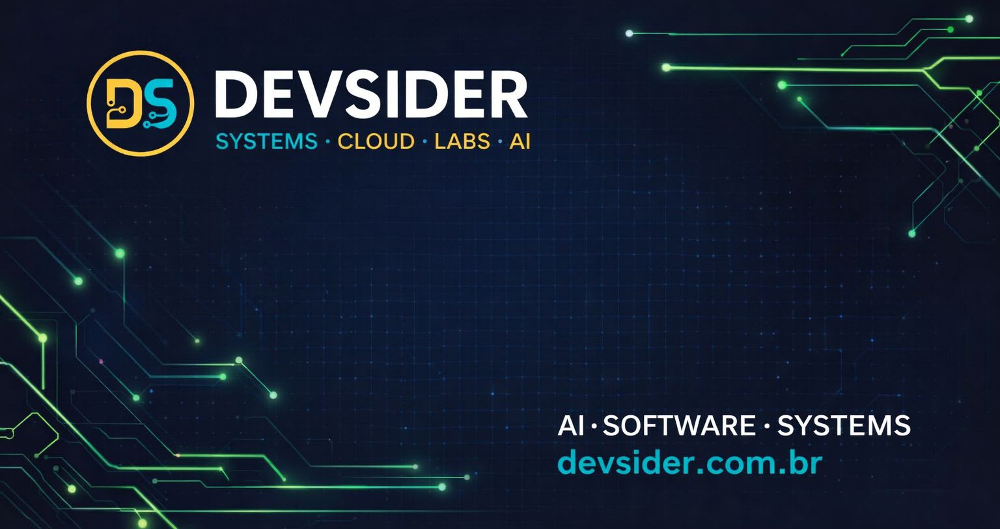

# Pedro Duarte

### 💻 Full Stack Developer | AI Automation | Software Engineer

Building scalable software, AI-powered automations and cloud solutions.

Currently working at **DevSider**.

 

---

# 👨‍💻 About Me

I'm a **Full Stack Developer** currently working at **DevSider**, where I develop modern software solutions, AI-powered automations, cloud applications and scalable systems.

I'm passionate about technology, software architecture and artificial intelligence, always looking for better ways to automate processes and build high-quality applications.

Besides my professional work, I'm pursuing a degree in **Software Engineering at PUC Minas**, constantly improving my technical skills and learning new technologies.

---

# 🚀 What I Do

- 🤖 AI Automation
- 💻 Full Stack Development
- ☁️ Cloud Applications
- ⚙️ REST APIs
- 📱 Mobile Development
- 🔄 Process Automation
- 🗄️ Database Modeling
- 🚀 Deployment & DevOps

---

# 🛠 Tech Stack

## Languages

## Front-end

## Back-end

## Databases

## DevOps & Cloud

---

# 💼 Professional Experience

## Full Stack Developer — DevSider

Currently working on:

- AI Automations
- Cloud Solutions
- Full Stack Applications
- REST APIs
- Software Architecture
- Process Automation
- Modern Web Applications

---

# 🚀 Featured Projects

### ⚽ Football Social Network

A LinkedIn-inspired platform connecting football players, clubs and scouts.

---

### 🤖 WhatsApp Automation Platform

Automation platform capable of importing contacts, scheduling message flows and executing asynchronous processing.

---

### 📊 ContabilFlow

Accounting management system with complete Full Stack architecture.

---

### 📱 FPStats

Mobile application focused on football statistics and player information.

---

# 📈 GitHub Stats

---

# 📊 GitHub Summary

  

---

# 📫 Contact

---

### ⭐ Thanks for visiting my profile!

