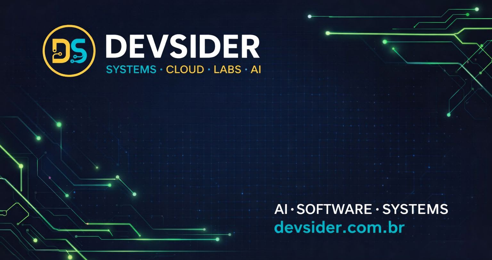

# 🚀 Pedro Duarte
### **Full Stack Developer • AI Automation • Software Engineer**

*Building scalable software, AI-powered automations, and cloud solutions.*

 

---

## 👨‍💻 About Me

- 🔭 Currently working at **DevSider**, building process automation platforms, backend services, and modern web applications.
- 🎓 Software Engineering Student at **PUC Minas**.
- 💡 Core Focus: **AI & Automations**, Software Architecture, and Cloud Engineering.
- ⚡ Fun Fact: Passionate about football, sports analytics, and building complex automated systems.

---

## 🛠️ Tech Stack & Tools

<b>💻 Languages & Frameworks</b>

 

  

<b>🗄️ Databases, DevOps & Tools</b>

 

  

---

## 📂 Featured Projects

 

| Project | Description | Tech Stack | Status |
| :--- | :--- | :--- | :---: |
| ⚽ **Football Social Network** | LinkedIn-inspired networking platform connecting players, clubs, and scouts. | `Next.js` `TypeScript` `Prisma` | 🟢 In Dev |
| 🤖 **WhatsApp Automation** | Automated messaging platform featuring message queues, custom workflows, and CSV import. | `Node.js` `Express` `Docker` | 🟢 Active |
| 📊 **ContabilFlow** | Modern accounting management platform streamlining enterprise workflows. | `React` `NestJS` `PostgreSQL` | 🟢 Active |
| 📱 **FPStats** | Mobile app dedicated to real-time football performance metrics and statistics. | `Flutter` `REST API` | 🟢 Active |

---

## 📊 GitHub Analytics

 

### 📈 Activity Graph

---

## 🐍 Contribution Snake Animation

<picture>
  <source media="(prefers-color-scheme: dark)" srcset="https://raw.githubusercontent.com/pedrorodriguesduarte/pedrorodriguesduarte/output/github-contribution-grid-snake-dark.svg">
  <source media="(prefers-color-scheme: light)" srcset="https://raw.githubusercontent.com/pedrorodriguesduarte/pedrorodriguesduarte/output/github-contribution-grid-snake.svg">
  
</picture>

---

👀 **Profile Views:**  

